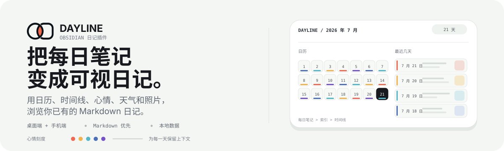

<p align="right">
  <strong>中文</strong> | <a href="./README.en.md">English</a>
</p>

<p align="center">
  
</p>

# Dayline Journal

Dayline 把一文件夹的 Markdown 每日笔记变成 Obsidian 里的可视化日记。你可以在月历中查看一天，在时间线里搜索过去，记录心情和天气，同时不必移动或改写原有笔记。

插件支持 Obsidian 桌面端和手机端，适合已经在使用 [Daily Notes](https://help.obsidian.md/plugins/daily-notes) 的 vault。

## 不只看到文件，还能看到日记

日历可以显示图片封面、心情标记、天气和多篇日记徽标。点击日期即可打开笔记；缺少笔记时，确认一次就会按 Daily Notes 模板创建（支持 Templater）。

<p align="center">
  
</p>

时间线会把同一批 Markdown 笔记整理成可浏览的日记记录。全文搜索和筛选覆盖日期范围、来源、心情、收藏、位置、标签和媒体类型。

<p align="center">
  
</p>

截图来自仓库内的 [`showcase/`](showcase/README.md) 合成测试库，不包含真实日记、真实位置、EXIF 或个人下载素材；媒体来源见 [`showcase/MEDIA_ATTRIBUTIONS.md`](showcase/MEDIA_ATTRIBUTIONS.md)。

## 主要能力

- **会读取日记的日历。** 每日笔记中的图片会成为日期格背景，心情颜色、可选天气、今天、浏览日期和多篇日记状态都一目了然。
- **为回忆而做的时间线。** 搜索日记全文，并按日期、来源、心情、收藏、位置、标签和媒体类型筛选。
- **有上下文的心情记录。** 五级颜色、备注和标签，可查看趋势与报告，也提供恢复、备份、完整性检查及 JSON/CSV 导出。
- **回忆与媒体。** “去年今日”会整理往年摘要和照片墙，入口可以关闭、合并进天气卡或放到顶栏图标；图片、视频和音频条目支持封面、元数据、EXIF 浮层，以及桌面端 HEIC/HEIF 缩略图。
- **可定制的心情标记。** 日期格上的心情可以用角落色点，也可以改成底部色条并让日期居中；窄侧栏下日期、天气和心情会分列在格子四角。
- **桌面端与手机端。** 手机视图支持日历/时间线切换、触控控件、键盘自适应心情编辑，并可从 Markdown 笔记快速进入。
- **vault 仍是数据源。** 日记正文继续使用 Markdown。Dayline 只索引你选择的目录，并把可视化元数据单独保存，笔记始终可读、可迁移。

## 工作方式

1. 指定每日笔记文件夹。
2. Dayline 识别日期并索引其中的 Markdown 笔记。你也可以把外部导入目录添加为普通日记来源。
3. 通过日历或时间线浏览，记录心情和上下文，然后直接从日期打开 Obsidian 笔记。

默认情况下，心情元数据保存在 `Calendar/journal-metadata.json`，天气快照保存在插件的 `data.json`。Frontmatter 心情镜像默认关闭。Dayline 不依赖远程媒体：附件链接仍留在 vault；你未主动开启前，不会把 EXIF GPS 坐标交给反向地理编码服务。

## 安装

**在 Obsidian 中安装**

1. 打开 **设置 → 第三方插件**。
2. 浏览并安装 **Dayline Journal**。
3. 启用插件，然后运行命令 `Open Dayline`。

**通过 BRAT**

1. 安装并启用 [BRAT](https://github.com/TfTHacker/obsidian42-brat)。
2. 添加 Beta 插件 `Haoo-7/Obsidian-Dayline`。
3. 启用 **Dayline Journal**，然后运行命令 `Open Dayline`。

**手动安装**

1. 从 [Releases](https://github.com/Haoo-7/Obsidian-Dayline/releases) 下载 `dayline.zip`。
2. 解压到 vault 的 `.obsidian/plugins/dayline-journal/`。
3. 重新加载 Obsidian，启用 **Dayline Journal**，然后运行 `Open Dayline`。

如果新插件目录没有 `data.json`，Dayline 会迁移旧 `dayline` 或 Calendar Sidebar 1.x 的设置。迁移不会改写 vault 笔记和心情元数据。

<details>
<summary><strong>设置项</strong>（按设置界面的分组排列）</summary>

**常规**

| 设置 | 作用 |
| --- | --- |
| **显示语言** | 统一控制插件界面、提示、标签和辅助文本。默认中文。 |
| **每周起始日** | 设置日历每周从星期几开始。默认跟随系统。 |

**日历和日记**

| 设置 | 作用 |
| --- | --- |
| **日记来源目录** | 配置每日笔记目录（`默认日记目录` 字段，默认 `Calendar/Daily`）和可选外部导入目录。旧版独立条目来源不再默认启用。 |
| **缩略图筛选** | 选择哪些嵌入图片作为日期缩略图：`所有嵌入图片`（默认）或 `仅日期前缀 (YYYY-MM-DD_*)`。 |
| **日记工具** | 打开时间线或检测外部导入目录。 |
| **显示时间线心情趋势** | 在日记时间线顶部显示近七天的心情轨迹。默认开启。 |
| **显示时间轴日记标题** | 在日记时间线中显示标题及标题编辑入口。默认开启。 |
| **显示日历心情标记** | 在日期格显示心情颜色标记；关闭后不会删除心情记录。默认开启。 |
| **日历心情样式** | `色点` 放在格子角落（默认）；`色条` 贴在底部并让日期保持居中。仅在上面的标记开启时显示。 |
| **显示同日记录角标** | 同一天有多篇记录时显示额外篇数，点击角标打开主日记。默认开启。 |
| **显示日历天气卡片** | 显示月历顶部天气卡片；关闭后不影响日期格天气图标。默认开启。 |
| **显示天气位置** | 在天气卡片中显示配置的地点名称。默认关闭；仅在天气卡片开启时显示。 |
| **显示日期天气图标** | 显示日期格右上角天气图标；关闭后不影响顶部天气卡片。默认开启。 |

**心情**

| 设置 | 作用 |
| --- | --- |
| **镜像心情到 frontmatter** | 开启后保存心情时才写入 Markdown 的 `mood` 和 `mood_labels`。默认关闭。 |
| **每日提醒** | 今天没有日记记录时显示本地提醒。默认关闭。 |

**天气**（需先开启 `启用天气`，否则下列各项不显示）

| 设置 | 作用 |
| --- | --- |
| **启用天气** | 在日历侧边栏中显示日期天气信息。默认关闭。 |
| **纬度** / **经度** | 所在地坐标，决定天气数据来源。 |
| **位置名称** | 显示名称（可选，鼠标悬停时显示）。 |
| **温度单位** | `摄氏 (°C)`（默认）或 `华氏 (°F)`。 |
| **天气字段** | 选择天气卡片中显示的字段。体感和湿度默认开启；风速、降水、日出、日落和位置可单独开启。 |
| **天气时区** | 日记日期比较和 Open-Meteo 使用的 IANA 时区。`auto` 使用系统时区。 |
| **自动获取天气** | 打开日记时自动获取天气数据。默认开启。 |
| **缓存时长（小时）** | 天气数据缓存的有效时长，过期后重新获取。默认 2 小时。 |

**媒体元数据与隐私**

| 设置 | 作用 |
| --- | --- |
| **显示图片 EXIF 信息** | 鼠标悬停在日历图片上时，显示相机参数和拍摄数据。默认开启。 |
| **解析 GPS 地点** | 将 EXIF GPS 坐标发送到 OpenStreetMap Nominatim 以显示地名。**默认关闭**，未主动开启前不会发送坐标。 |

**去年今日**

| 设置 | 作用 |
| --- | --- |
| **侧边栏入口** | `关闭`、`合并进天气卡`（默认）或 `顶栏图标`。合并条带显示往年封面和日期，顶栏图标位于月份控件旁。 |
| **日历上显示标记** | 在有往年记录的日期格子上显示小圆点标记。默认关闭。 |
| **摘要模式** | 如何生成往年日记的文字预览：`自动提取正文`（默认）、`从 frontmatter 字段`、`自定义模板` 或 `不显示摘要`。 |
| **Frontmatter 字段名** | 读取哪个 frontmatter 键。默认 `excerpt`，仅在 `从 frontmatter 字段` 模式下显示。 |
| **模板** | 自定义摘要的模板字符串，支持 `{body}`、`{year}`、`{date}` 或任意 frontmatter 键。默认 `{body}`，仅在 `自定义模板` 模式下显示。 |

**数据与维护**

| 设置 | 作用 |
| --- | --- |
| **心情元数据路径** | vault 内 JSON 路径。默认 `Calendar/journal-metadata.json`，JSON 是心情主数据源。 |
| **心情导出** | 导出心情记录为 CSV 或 JSON。 |
| **元数据备份** | 导出或恢复心情元数据备份。 |
| **数据维护** | 检查数据完整性或导入 frontmatter 记录。 |
| **恢复心情记录** | 检查被删除或移走的心情记录，并恢复到原始文件路径。仅在检测到孤立记录时出现。 |
| **回填历史天气** | 为所有已有日记但缺少天气数据的日期批量拉取天气（约需数分钟）。仅在开启 `启用天气` 后出现。 |

</details>

<details>
<summary><strong>天气、导入和日期识别</strong></summary>

天气功能可选，使用 [Open-Meteo](https://open-meteo.com/) 且不需要 API Key。天气卡可显示当前条件；历史日期会在归档接口有覆盖时读取历史数据。

导入 Day One 或 Apple Journal 时，先使用 [Day One Importer](https://github.com/MarcDonald/obsidian-day-one-importer) 或 [Obsidian Importer](https://github.com/obsidianmd/obsidian-importer)，再把输出目录添加为 Journal source。Dayline 不解析 JSON/ZIP 导出，也不改写导入文件。

日期会依次从配置的日期字段、`date`、`creationDate` 和合法的日期前缀文件名识别。插件不会用修改时间猜测日期；无法解析日期的文件会进入诊断，而不会进入时间线。

</details>

## 兼容性与限制

- 需要 **Obsidian v1.5.0+**，支持桌面端和手机端。
- 每日笔记默认使用 `YYYY-MM-DD.md`，目录、来源和日期字段可以配置。
- HEIC/HEIF 缩略图转换仅在桌面端提供。视频封面、音频封面以及不支持或过大的媒体，会根据设备能力降级为元数据或原始附件。
- 历史天气是否可用取决于归档覆盖。刷新失败时，兼容的缓存可能继续显示为过期或离线状态。
- 时间线只打开你配置目录中的笔记，不替代 Obsidian 的文件浏览器、Markdown 编辑器或同步系统。

## 开发

```bash
npm install
npm run typecheck
npm test
npm run build
```

仓库中的 `main.js` 由构建生成。打包发布前请运行 `npm run verify:release`，版本变更见 [CHANGELOG.md](CHANGELOG.md)。

## 许可证

[MIT](LICENSE)
