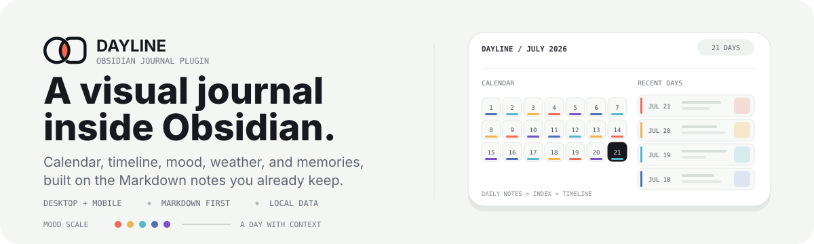

<p align="right">
  <strong>English</strong> | <a href="./README.zh-CN.md">中文</a>
</p>

<p align="center">
  
</p>

# Dayline Journal

Dayline turns a folder of Markdown daily notes into a visual journal inside Obsidian. Browse a monthly calendar, search a timeline, track mood and weather, and return to past days without moving or rewriting your notes.

It runs on Obsidian desktop and mobile, and is built for vaults that already use [Daily Notes](https://help.obsidian.md/plugins/daily-notes).

## See the journal, not just the files

The calendar can show photo covers, mood markers, weather, and multiple-entry badges. Click a date to open its note, or confirm once and create the missing note from your Daily Notes template (Templater supported).

<p align="center">
  
</p>

The journal timeline turns the same notes into a browsable record. Full-text search and filters cover date range, source, mood, favorite, location, tag, and media type.

<p align="center">
  
</p>

The screenshots come from the synthetic, privacy-safe vault in [`showcase/`](showcase/README.md). The sample contains no real journal entries, locations, EXIF data, or downloaded personal media. Media sources are listed in [`showcase/MEDIA_ATTRIBUTIONS.md`](showcase/MEDIA_ATTRIBUTIONS.md).

## What you get

- **A calendar that reads your journal.** Daily note images become date-cell covers; mood colors, optional weather, today, browsing date, and multiple-entry states are visible at a glance.
- **A timeline built for recall.** Search the full text of your journal and narrow it with date, source, mood, favorite, location, tag, and media filters.
- **Mood with context.** Use five color levels with notes and labels, then review trends and reports. Recovery, backup, integrity checks, and JSON/CSV export are included.
- **Memories and media.** On This Day brings back summaries and a photo wall. Image, video, and audio entries support covers, metadata, EXIF tooltips, and desktop HEIC/HEIF thumbnails.
- **Desktop and mobile.** The phone view includes calendar and timeline switching, touch-friendly controls, keyboard-aware mood editing, and quick entry from a Markdown note.
- **Your vault remains the source.** Journal bodies stay Markdown. Dayline indexes the folders you choose and keeps its visual metadata separate, so the notes remain readable and portable.

## How it works

1. Point Dayline at your daily notes folder.
2. The plugin resolves dates and indexes the Markdown notes in that folder. You can add external import folders as ordinary journal sources.
3. Browse the result in the calendar or timeline, record mood and context, then open any date directly in Obsidian.

By default, mood metadata is stored in `Calendar/journal-metadata.json`, while weather snapshots live in the plugin's `data.json`. Frontmatter mood mirroring is optional. Dayline never needs remote media: attachment links stay in your vault, and EXIF GPS reverse geocoding is off until you explicitly enable it.

## Install

**From Obsidian**

1. Open **Settings → Community plugins**.
2. Browse and install **Dayline Journal**.
3. Enable the plugin, then run the command `Open Dayline`.

**Using BRAT**

1. Install and enable [BRAT](https://github.com/TfTHacker/obsidian42-brat).
2. Add `Haoo-7/Obsidian-Dayline` as a beta plugin.
3. Enable **Dayline Journal**, then run the command `Open Dayline`.

**Manual installation**

1. Download `dayline.zip` from [Releases](https://github.com/Haoo-7/Obsidian-Dayline/releases).
2. Extract it to `.obsidian/plugins/dayline-journal/` in your vault.
3. Reload Obsidian, enable **Dayline Journal**, then run `Open Dayline`.

When the new plugin folder has no `data.json`, Dayline migrates settings from an earlier `dayline` installation or Calendar Sidebar 1.x. Vault notes and mood metadata are not rewritten by the migration.

<details>
<summary><strong>Settings reference</strong></summary>

| Setting | What it controls |
| --- | --- |
| **Daily notes folder** | Default folder used to open and create daily notes. Includes search and browse. |
| **Thumbnail filter** | Use every embedded image, or only filenames beginning with `YYYY-MM-DD_`. |
| **Journal sources** | Optional external folders added as ordinary timeline sources. |
| **Mood metadata path** | Vault JSON path, default `Calendar/journal-metadata.json`. |
| **Mirror mood to frontmatter** | Copies saved mood data into `mood` and `mood_labels`; off by default. |
| **Resolve GPS locations** | Opt-in EXIF reverse geocoding through OpenStreetMap Nominatim. |
| **Show mood markers on calendar** | Toggles mood colors in calendar date cells. |
| **Show calendar weather card** | Toggles the weather card above the calendar. |
| **Show date weather icons** | Toggles weather icons in the top-right of date cells. |
| **Show extra-entry badge** | Toggles the `+n` badge on dates with multiple journals. |
| **Weather fields** | Feels-like temperature and humidity are on by default; wind, precipitation, sunrise, sunset, and location are optional. |
| **Daily reminder** | Optional local reminder to record the day. |

</details>

<details>
<summary><strong>Weather, imports, and date matching</strong></summary>

Weather is optional and uses [Open-Meteo](https://open-meteo.com/) without an API key. The weather card can show current conditions, while historical dates use the archive endpoint when coverage is available.

For Day One or Apple Journal imports, first use [Day One Importer](https://github.com/MarcDonald/obsidian-day-one-importer) or [Obsidian Importer](https://github.com/obsidianmd/obsidian-importer), then add the output folder as a Journal source. Dayline does not parse JSON/ZIP exports or rewrite the imported files.

Dates are matched from the configured date field, then `date`, `creationDate`, and finally a valid date-prefixed filename. Modification time is never used as a date fallback. Files without a resolvable date appear in diagnostics rather than being guessed into the timeline.

</details>

## Compatibility and limits

- **Obsidian v1.5.0+**, on desktop and mobile.
- Daily notes default to `YYYY-MM-DD.md`, but the folder, source, and date field are configurable.
- HEIC/HEIF thumbnail conversion is desktop-only. Video covers, audio artwork, and unsupported or oversized media can fall back to metadata or the original attachment depending on the device.
- Historical weather is best-effort because it depends on archive coverage. When refresh fails, compatible cached data can remain visible as stale or offline.
- The timeline opens notes from the folders you configure. It does not replace Obsidian's file browser, Markdown editor, or sync system.

## Development

```bash
npm install
npm run typecheck
npm test
npm run build
```

The tracked `main.js` is generated by the build. Run `npm run verify:release` before packaging a release, and see [CHANGELOG.md](CHANGELOG.md) for released changes.

## License

[MIT](LICENSE)
