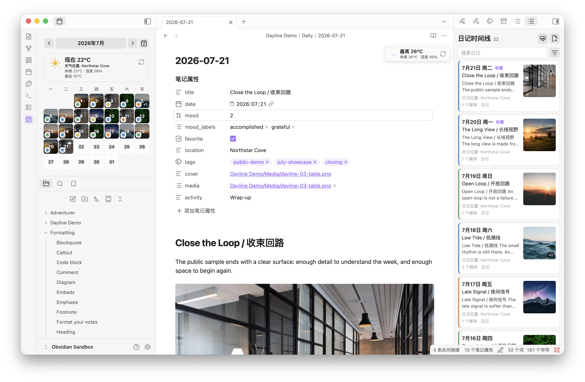
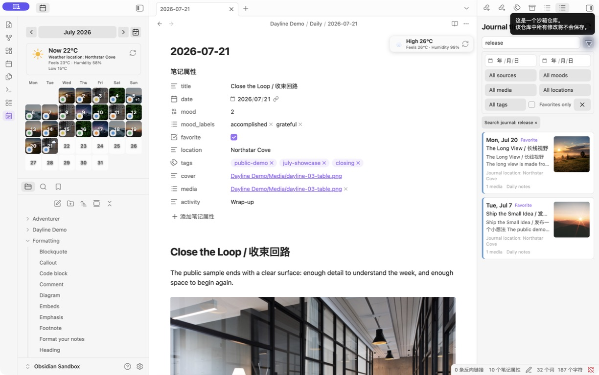

  <a href="README.en.md"><strong>English</strong></a>
  ·
  <a href="README.zh-CN.md"><strong>中文</strong></a>

---

# Dayline — Obsidian Plugin

  

Dayline is a visual journal for calendars, timelines, moods, memories, weather, and photos.

## Public showcase

The repository includes a synthetic, privacy-safe showcase vault with calendar and timeline data. Its July 1-21 sample has 21 image-backed dates with mood markers; July 22 onward is intentionally empty:

The timeline also supports full-text search and multi-dimensional filters:

The screenshots use fictional entries, a fictional location, generated audio/video, and resized public photographs. See [`showcase/README.md`](showcase/README.md) for the sandbox setup and [`showcase/MEDIA_ATTRIBUTIONS.md`](showcase/MEDIA_ATTRIBUTIONS.md) for media sources.

- Monthly calendar in the left sidebar
- Image thumbnails from daily notes as date cell backgrounds
- Today highlight (full accent fill) + browsing-date highlight (accent border)
- One-click open daily notes
- Auto-create missing notes with confirmation dialog, from Daily Notes template (Templater supported)
- Configurable daily folder with search suggest
- Thumbnail filter: all images or date-prefixed only
- Weather card with Open-Meteo integration (optional, cached in plugin data)
- EXIF metadata tooltips for calendar and daily-note images
- HEIC/HEIF thumbnail conversion on desktop
- On This Day review with excerpts and photo wall
- Calendar cells distinguish journal records from weather-only cached dates; multiple records show a configurable `+n` badge, and clicking a date opens the primary journal
- Image/video/audio entries support explicit `cover` links, best-effort video covers, and media metadata tooltips
- Journal timeline with full-text search; date, source, mood, favorite, location, tag, and media filters
- Five-level mood picker with notes, built-in/custom labels, recovery, backup/integrity tools, JSON/CSV export, and local trend reports

Weather snapshots are stored in the plugin's `data.json`, not written into daily-note frontmatter. The weather card defaults to feels-like temperature and humidity; wind, precipitation, sunrise, sunset, and location are optional fields that default off. Historical `_calendar_weather` frontmatter is read for backward compatibility and migrated when compatible. Eligible Open-Meteo failures retry up to three times; stale/offline cached data remains visible when a refresh fails, without persisting transient status flags. Historical archive data is best-effort. EXIF GPS reverse geocoding is disabled by default and can be enabled explicitly in settings. EXIF, HEIC, video-cover, and audio-artwork work is bounded and capability-aware, so unsupported or oversized media falls back safely.

Journal bodies remain Markdown. The timeline indexes the configured daily-notes folder by default (`Calendar/Daily`). Optional external-import folders can be added as ordinary journal sources; they do not create a separate entry type, and the timeline source filter can narrow the timeline to one source. Dates are resolved from the configured date field, `date`, `creationDate`, and then valid date-prefixed filenames; modification time is never used as a fallback. Use [Day One Importer](https://github.com/MarcDonald/obsidian-day-one-importer) or [Obsidian Importer](https://github.com/obsidianmd/obsidian-importer) for external imports, then add the output directory. This plugin does not parse JSON/ZIP exports or rewrite imported files.

Mood metadata is authoritative in `Calendar/journal-metadata.json` by default. Markdown frontmatter is unchanged unless mirroring is enabled, and deleted-note records remain recoverable as orphans.

Calendar display can be simplified in Dayline settings with three independent switches: mood markers, the weather card above the calendar, and weather icons in the top-right of date cells. These switches affect only the calendar view; mood records, weather cache, and the journal timeline remain available.

**Installation**: Add `Haoo-7/Obsidian-Dayline` to BRAT, or download `dayline.zip` from [Releases](https://github.com/Haoo-7/Obsidian-Dayline/releases) and extract to `.obsidian/plugins/dayline/`. On first launch, Dayline migrates the old plugin `data.json` when the new directory has no data file.

---

# Dayline — Obsidian 插件

Dayline 是一个集日历、日记时间线、心情记录、去年今日、天气和照片于一体的可视化日记工具。

- **月历视图** — 显示在左侧侧边栏文件管理器上方
- **图片缩略图** — 自动提取日记中嵌入的图片作为日期格子背景
- **今日与浏览日期高亮** — 分别使用全色块和边框标识
- **单击打开与自动创建** — 点击日期打开日记；没有日记时可确认后从 Daily Notes 模板创建（支持 Templater）
- **可配置日记文件夹** — 支持搜索和浏览选择路径
- **缩略图过滤** — 可显示全部嵌入图片，或仅显示文件名以 `YYYY-MM-DD_` 开头的图片
- **EXIF 信息** — 在日历格子和日记图片上查看拍摄信息；GPS 反向地理编码默认关闭
- **HEIC/HEIF 支持** — 桌面端自动转换并显示图片缩略图
- **去年今日** — 查看往年同日的日记摘要和照片墙
- **日历条目状态** — 区分日记记录和仅有天气缓存的日期；多篇日记会显示可配置的 `+n` 徽标，点击日期会打开主日记
- **图片/视频/音频** — 支持显式 `cover`、尽力而为的视频封面及媒体元数据浮层
- **日记时间线** — 默认索引每日笔记，支持全文搜索、日期/来源/心情/收藏/位置/标签/媒体筛选，并在相邻 Markdown leaf 中打开
- **可视化心情** — 五级颜色感受刻度加备注、内置/自定义标签，支持恢复、备份/完整性工具、JSON/CSV 导出和趋势报告

## 天气功能（可选）

天气使用 [Open-Meteo](https://open-meteo.com/)（无需 API Key），可在设置中配置坐标、位置名称、温度单位、自动获取和缓存时间。天气快照保存在插件的 `data.json` 中，不写入日记 frontmatter；天气卡默认显示体感温度和湿度，风速、降水、日出、日落和位置均为默认关闭的可选字段。旧版 `_calendar_weather` 字段仍会在配置匹配时读取和迁移。Open-Meteo 对可重试故障最多重试三次，刷新失败时会保留过期/离线缓存标记，且不会将这些临时状态写入正式缓存；历史归档数据为尽力而为。EXIF、HEIC、视频封面和音频专辑封面均受资源上限和设备能力约束，不支持或过大的媒体会安全降级。日历显示提供两个独立天气开关：分别控制月历顶部天气卡片，以及日期格右上角天气图标；关闭显示不影响天气缓存、笔记天气浮层或时间线。

## 日记索引与外部导入

日记正文仍然是 Markdown。时间线默认只索引每日笔记文件夹（默认 `Calendar/Daily`）。如需兼容 Day One 或 Apple Journal 的导入结果，可在 Journal sources 中添加外部目录；这些文件会作为普通日记显示，不产生独立的条目类型，可使用时间线来源筛选器缩小时间线范围。日期按配置日期字段、`date`、`creationDate`、合法日期文件名的顺序识别；无法识别日期的文件会进入诊断列表，不使用修改时间猜测。

Day One 或 Apple Journal 导入请先使用专业导入插件，再把输出目录加入 Journal sources：

- [Day One Importer](https://github.com/MarcDonald/obsidian-day-one-importer)
- [Obsidian Importer](https://github.com/obsidianmd/obsidian-importer)

本插件不解析 Day One JSON/ZIP，也不重写导入文件，只在索引层兼容 `creationDate`、`date`、`uuid`、`starred`、`favorite`、`location`、`coordinates`、`latitude` 和 `longitude` 等字段。

## 心情数据与日历显示

心情默认保存在 vault 内的 `Calendar/journal-metadata.json`，JSON 是主数据源，不会自动修改 Markdown。只有开启 frontmatter 镜像后，保存心情才会写入 `mood` 和 `mood_labels`；旧笔记中只有 frontmatter 的心情可读取显示，但需要执行导入命令后才会写入 JSON。文件重命名会同步记录键，删除的日记会进入可恢复孤立记录区，并提供导出、备份恢复和完整性检查命令。

「显示日历心情标记」、「显示日历天气卡片」和「显示日期天气图标」是三个独立开关，只影响日历视图的视觉显示，不删除或修改心情 JSON、天气缓存、Markdown，也不影响日记时间线。

**安装**：在 BRAT 中添加 `Haoo-7/Obsidian-Dayline`，或从 [Releases](https://github.com/Haoo-7/Obsidian-Dayline/releases) 下载 `dayline.zip` 解压到 `.obsidian/plugins/dayline/`。首次启动时，如果新目录没有 `data.json`，Dayline 会迁移旧插件的数据。

---

  <a href="README.en.md">View full English version →</a> &nbsp;·&nbsp; <a href="README.zh-CN.md">查看完整中文版 →</a>

